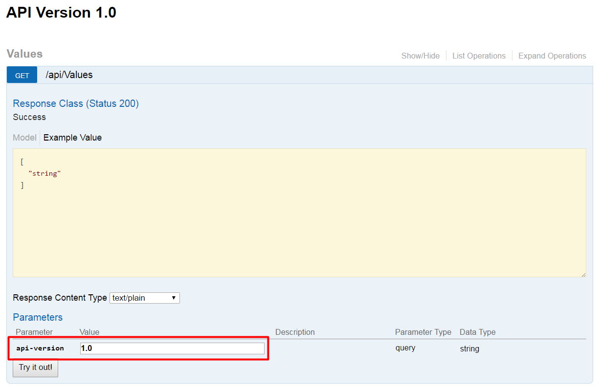

# Swashbuckle ASP.NET Versioning Shim
[](https://ci.appveyor.com/project/rh072005/swashbuckleaspnetversioningshim)

This library aids the use of [Swashbuckle](https://github.com/domaindrivendev/Swashbuckle.AspNetCore) and [ASP NET Web API Versioning](https://github.com/Microsoft/aspnet-api-versioning) together and started from my attempt at resolving [Swashbuckle.AspNetCore issue 244](https://github.com/domaindrivendev/Swashbuckle.AspNetCore/issues/244)

## Getting started

- Start by creating a new ASP.NET Core Web Application
- Install the SwashbuckleAspNetVersioningShim NuGet package from
  - Source or [Releases](https://github.com/rh072005/SwashbuckleAspNetVersioningShim/releases)
  - [MyGet](https://www.myget.org/feed/rh072005/package/nuget/SwashbuckleAspNetVersioningShim)
  - [NuGet](https://www.nuget.org/packages/SwashbuckleAspNetVersioningShim/)
- Add the following code blocks to Startup.cs

```csharp
using Microsoft.AspNetCore.Mvc.ApiExplorer;
```
```csharp
public void ConfigureServices(IServiceCollection services)
{
    services.AddMvc();
    services.AddMvcCore().AddVersionedApiExplorer();
    services.AddApiVersioning();
    services.AddSwaggerGen(c => {
        var provider = services.BuildServiceProvider().GetRequiredService<IApiVersionDescriptionProvider>();
        c.ConfigureSwaggerVersions(provider);
    });
    ...
```

```csharp
//Note the change of method signature to include injection of IApiVersionDescriptionProvider
public void Configure(IApplicationBuilder app, IHostingEnvironment env, ILoggerFactory loggerFactory, IApiVersionDescriptionProvider provider)
{
    ...
    app.UseMvc();
    app.UseApiVersioning();
    app.UseSwagger();
    app.UseSwaggerUI(c =>
    {
        c.ConfigureSwaggerVersions(provider);
    });
    ...
}
```   

All being well you can now continue to use ASP NET Web API Versioning as per it's documentation.
As a minimum your web API controller will want an ApiVersionAttribute and a RouteAttribute.
Using the default ValueController that's created with a new Web API project it would look like this

```csharp
[ApiVersion("1.0")]
[Route("api/v{api-version:apiVersion}/[controller]")]
public class ValuesController : Controller
{
    // GET api/values
    [HttpGet]
    public IEnumerable<string> Get()
    {
        return new string[] { "value1", "value2" };
    }
    ...
```

## Configuring routes and templates
If you want to configure the titles on the Swagger description page you can pass a title template to ```ConfigureSwaggerVersions``` inside ```ConfigureServices``` in your Startup file.
```csharp
public void ConfigureServices(IServiceCollection services)
{
    services.AddMvc();
    services.AddMvcCore().AddVersionedApiExplorer();
    services.AddApiVersioning();
    services.AddSwaggerGen(c => {
        var provider = services.BuildServiceProvider().GetRequiredService<IApiVersionDescriptionProvider>();
        c.ConfigureSwaggerVersions(provider, "Welcome to the documentation for version {0} of my API");
    });
    ...
```

Similarly, if you want to change the text in the version drop down you can using the ```SwaggerVersionOptions``` object. This lets you set the ```DescriptionTemplate``` for the version selector and ```RouteTemplate``` to alter the route.

```csharp
//Note the change of method signature to include injection of IApiVersionDescriptionProvider
public void Configure(IApplicationBuilder app, IHostingEnvironment env, ILoggerFactory loggerFactory, IApiVersionDescriptionProvider provider)
{
    ...
    app.UseMvc();
    app.UseApiVersioning();
    app.UseSwagger();
    app.UseSwaggerUI(c =>
    {
        c.ConfigureSwaggerVersions(provider, new SwaggerVersionOptions
        {
            DescriptionTemplate = "Vesion {0} docs", RouteTemplate = "/swagger/{0}/swagger.json"
        });
    });
    ...
}
```  

## Note about MapToApiVersion
When using ```MapToApiVersion``` ([example here](https://github.com/Microsoft/aspnet-api-versioning/wiki/Versioning-via-the-URL-Path#aspnet-core)) methods will be added for each ```ApiVersionAttribute``` specified on the controller. 
In the example this results in ```Get()``` and ```GetV3()``` being added to the 2.0 and 3.0 Swagger document.
To avoid this, which will cause an overload error in Swashbuckle, you will need to add explicitly add the ```MapToApiVersion``` attribute to both methods rather than letting ```Get()``` default.

Referring again to the example it would look like this
```csharp
[ApiVersion("2.0")]
[ApiVersion("3.0")]
[Route("api/v{version:apiVersion}/helloworld")]
public class HelloWorld2Controller : Controller
{
    [HttpGet, MapToApiVersion("2.0")]
    public string Get() => "Hello world v2!";

    [HttpGet, MapToApiVersion("3.0")]
    public string GetV3() => "Hello world v3!";
}
```

## Using querystring versions
As of version 1.0.0-beta.1 and thanks to [Microsoft.AspNetCore.Mvc.Versioning](https://www.nuget.org/packages/Microsoft.AspNetCore.Mvc.Versioning.ApiExplorer), querystring versioned APIs are now supported.

In a controller where no API version is specified a new parameter will be added to Swagger and will default to the API version you are browsing. 

So this controller
```csharp
[ApiVersion("1.0")]
[Route("api/[controller]")]
public class ValuesController : Controller
{
    // GET api/values
    [HttpGet]
    public IEnumerable<string> Get()
    {
        return new string[] { "value1", "value2" };
    }
}
```
will look like this



## License
See the [LICENSE](LICENSE) file for license rights and limitations (MIT).
